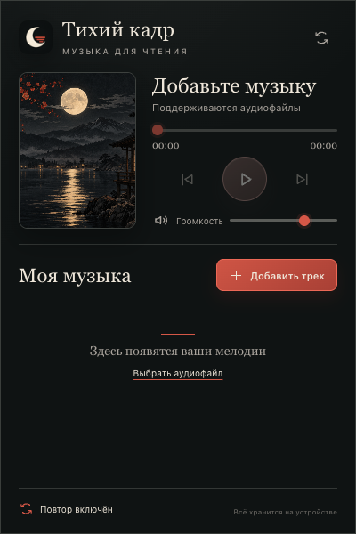
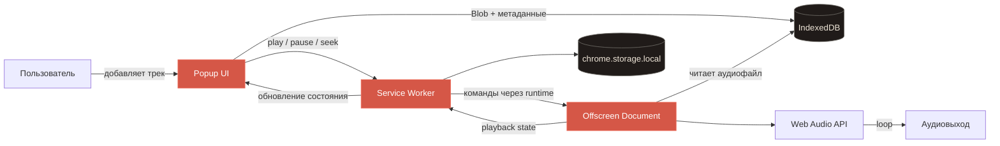
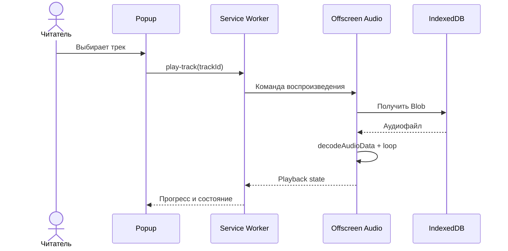
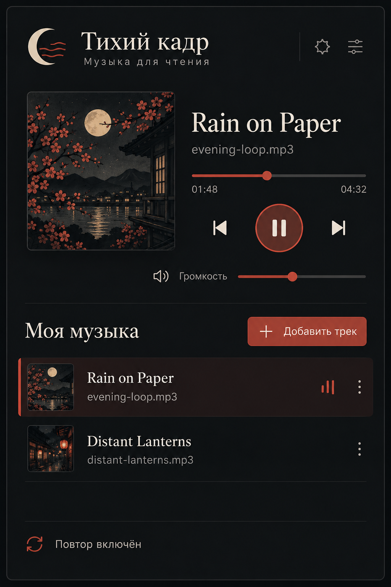

<p align="center">
  
</p>

<h1 align="center">Тихий кадр</h1>

<p align="center">
  Фоновая музыка без пауз для спокойного чтения манги.<br />
  Локально, минималистично и без отправки файлов в облако.
</p>

<p align="center">
  <a href="https://github.com/BigVovaRUU/music/releases"></a>
  
  
  
  
</p>

<p align="center">
  <a href="https://github.com/BigVovaRUU/music/archive/refs/heads/main.zip"><strong>Скачать исходный код</strong></a>
  ·
  <a href="https://github.com/BigVovaRUU/music/issues">Сообщить об ошибке</a>
  ·
  <a href="https://github.com/BigVovaRUU/music/issues/new">Предложить идею</a>
</p>

<p align="center">
  
</p>

## О проекте

**Тихий кадр** — компактный музыкальный проигрыватель для Chrome, созданный для чтения манги, ранобэ и других занятий, где нужна ненавязчивая фоновая атмосфера.

Добавьте аудиофайл, запустите воспроизведение и закройте popup: музыка продолжит играть в фоне. Трек повторяется через Web Audio без паузы между окончанием и новым циклом.

> [!IMPORTANT]
> Музыка не загружается на сервер. Аудиофайлы и состояние проигрывателя хранятся только в локальном профиле Chrome.

## Возможности

| Возможность | Как это работает |
| --- | --- |
| Непрерывный повтор | `AudioBufferSourceNode` воспроизводит один трек в режиме loop |
| Фоновое воспроизведение | Offscreen-документ продолжает работу после закрытия popup |
| Локальная библиотека | Файлы сохраняются в IndexedDB внутри профиля расширения |
| Управление проигрывателем | Play/pause, перемотка, громкость, предыдущий и следующий трек |
| Несколько аудиофайлов | Можно добавить сразу несколько треков и переключаться между ними |
| Приватность | Нет аналитики, аккаунтов, внешних API и отправки файлов в сеть |
| Доступность | Семантическая разметка, keyboard focus и поддержка `prefers-reduced-motion` |

## Быстрый старт

### Вариант 1 — скачать репозиторий

1. [Скачайте ZIP-архив ветки `main`](https://github.com/BigVovaRUU/music/archive/refs/heads/main.zip).
2. Распакуйте архив в отдельную папку.
3. Откройте в Chrome страницу `chrome://extensions`.
4. Включите **Режим разработчика**.
5. Нажмите **Загрузить распакованное расширение**.
6. Выберите распакованную папку проекта.
7. Закрепите «Тихий кадр» на панели Chrome.

### Вариант 2 — клонировать через Git

```bash
git clone https://github.com/BigVovaRUU/music.git
cd music
```

Затем загрузите папку проекта через `chrome://extensions` → **Загрузить распакованное расширение**.

### Обновление локальной версии

После получения свежих изменений откройте `chrome://extensions` и нажмите круговую стрелку на карточке расширения или кнопку **Обновить**.

## Как пользоваться

1. Откройте popup расширения.
2. Нажмите **Добавить трек** и выберите один или несколько аудиофайлов.
3. Выберите композицию в библиотеке и нажмите Play.
4. Настройте громкость и позицию воспроизведения.
5. Закройте popup и продолжайте читать — музыка останется в фоне.

## Архитектура



### Поток воспроизведения



## Разрешения Chrome

Расширение запрашивает только два разрешения:

| Разрешение | Назначение |
| --- | --- |
| `offscreen` | Воспроизведение музыки после закрытия popup |
| `storage` | Сохранение громкости, позиции и состояния проигрывателя |

Доступ к истории, вкладкам, содержимому сайтов, камере, микрофону и сетевым запросам не требуется.

## Технологии

- Chrome Extension Manifest V3;
- Web Audio API;
- Offscreen Documents API;
- IndexedDB;
- `chrome.storage.local`;
- Vanilla JavaScript, HTML и CSS — без сборщика и runtime-зависимостей.

## Структура проекта

```text
music/
├── assets/
│   ├── icons/                 # Иконки Chrome: 16, 32, 48 и 128 px
│   └── night-cover-512.png    # Обложка проигрывателя
├── design/
│   ├── popup-concept.png      # Исходный визуальный концепт
│   └── popup-implementation.png
├── db.js                      # Работа с IndexedDB
├── manifest.json              # Manifest V3 и разрешения
├── offscreen.html
├── offscreen.js               # Декодирование и loop через Web Audio
├── popup.html
├── popup.css
├── popup.js                   # Интерфейс и библиотека треков
├── service-worker.js          # Маршрутизация команд и состояния
└── README.md
```

## Локальная проверка

Проект не требует установки зависимостей. Для быстрой проверки синтаксиса:

```bash
node --check popup.js
node --check service-worker.js
node --check offscreen.js
```

После изменений обновите расширение на `chrome://extensions` и проверьте сценарий:

```text
добавить аудиофайл → запустить → закрыть popup → открыть снова → поставить на паузу
```

## Визуальное направление

Интерфейс построен вокруг спокойной ночной эстетики: графитовый фон, оттенок рисовой бумаги, приглушённый киноварный акцент и типографика с редакционным характером. Иконка и иллюстрация созданы специально для проекта.

<details>
  <summary><strong>Посмотреть исходный дизайн и реализацию</strong></summary>
  <br />
  <p align="center">
    
    &nbsp;&nbsp;
    
  </p>
</details>

## Roadmap

- [x] Локальная библиотека аудиофайлов
- [x] Фоновое воспроизведение
- [x] Непрерывный loop одного трека
- [x] Громкость, перемотка и переключение композиций
- [ ] Плейлисты для разных жанров манги
- [ ] Fade-in и fade-out
- [ ] Горячие клавиши
- [ ] Импорт и экспорт настроек
- [ ] Публикация в Chrome Web Store

## Участие в разработке

Идеи, сообщения об ошибках и pull request приветствуются.

1. Сделайте fork репозитория.
2. Создайте ветку: `git switch -c feature/my-idea`.
3. Внесите изменение и проверьте расширение локально.
4. Создайте commit с понятным описанием.
5. Откройте pull request в `main`.

Перед созданием issue проверьте [существующие обсуждения](https://github.com/BigVovaRUU/music/issues). Для ошибки укажите версию Chrome, шаги воспроизведения и приложите скриншот страницы `chrome://extensions` при наличии ошибки.

## FAQ

<details>
  <summary><strong>Продолжит ли музыка играть после закрытия popup?</strong></summary>
  <br />
  Да. За воспроизведение отвечает отдельный offscreen-документ Chrome.
</details>

<details>
  <summary><strong>Куда загружаются мои треки?</strong></summary>
  <br />
  Никуда. Они сохраняются локально в IndexedDB профиля расширения.
</details>

<details>
  <summary><strong>Почему после изменения кода интерфейс не обновился?</strong></summary>
  <br />
  Chrome кэширует загруженное расширение. Нажмите кнопку обновления на странице <code>chrome://extensions</code>.
</details>

<details>
  <summary><strong>Какие форматы поддерживаются?</strong></summary>
  <br />
  Расширение принимает аудиоформаты, которые умеет декодировать установленная версия Chrome, включая распространённые MP3, WAV, OGG и M4A/AAC.
</details>

## Лицензия

Лицензия пока не выбрана. До добавления файла `LICENSE` исходный код доступен для просмотра, однако стандартные права на копирование, изменение и распространение автоматически не предоставляются.

Если проект должен стать полноценным open-source, перед публикацией выберите подходящую лицензию — например, MIT или Apache-2.0 — и добавьте её отдельным файлом.

---

<p align="center">
  Сделано для тех моментов, когда история остаётся в центре внимания, а музыка — рядом.
</p>
