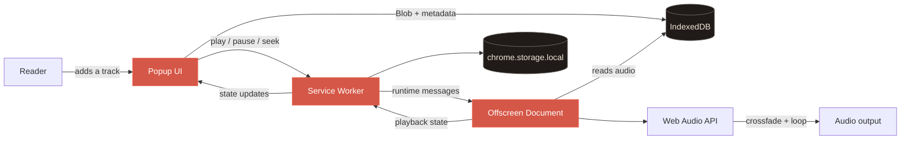
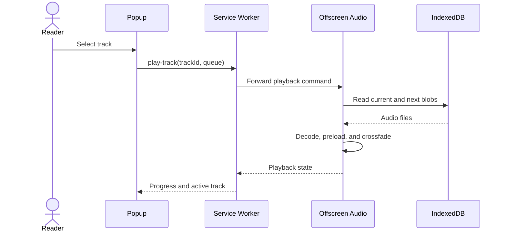

<p align="center">
  
</p>

<h1 align="center">Тихий кадр · Quiet Frame</h1>

<p align="center">
  <a href="../README.md">Русский</a> ·
  <strong>English</strong> ·
  <a href="./README.ja.md">日本語</a> ·
  <a href="./README.zh-CN.md">简体中文</a>
</p>

<p align="center">
  Seamless background music for calm manga reading.<br />
  Local, minimal, and private by design.
</p>

<p align="center">
  <a href="https://github.com/BigVovaRUU/music/releases"></a>
  
  
  
  
</p>

<p align="center">
  <a href="https://github.com/BigVovaRUU/music/archive/refs/heads/main.zip"><strong>Download source</strong></a>
  ·
  <a href="https://github.com/BigVovaRUU/music/issues">Report a bug</a>
  ·
  <a href="https://github.com/BigVovaRUU/music/issues/new">Suggest an idea</a>
</p>

<p align="center">
  
</p>

## About

**Quiet Frame** is a compact Chrome music player designed for manga, light novels, and any activity that benefits from a subtle background atmosphere.

Add an audio file, start playback, and close the popup—the music keeps playing in the background. The next track is preloaded and starts five seconds before the current track ends, producing a stable crossfade. When the library contains only one track, an overlapping copy provides a continuous repeat.

> [!IMPORTANT]
> Music is never uploaded to a server. Audio files and playback state remain inside the local Chrome extension profile.

## Features

| Feature | How it works |
| --- | --- |
| Continuous single-track repeat | A second copy starts early and overlaps the ending |
| Five-second crossfade | The next decoded track fades in while the current one fades out |
| Background playback | An offscreen document keeps playing after the popup closes |
| Local library | Audio blobs are stored in extension-scoped IndexedDB |
| Player controls | Play/pause, seek, volume, previous, and next |
| Multiple audio files | Add several files at once and move through the queue |
| Privacy | No analytics, accounts, external APIs, or file uploads |
| Accessibility | Semantic controls, visible keyboard focus, and reduced-motion support |

## Quick start

### Download the repository

1. [Download the `main` branch as ZIP](https://github.com/BigVovaRUU/music/archive/refs/heads/main.zip).
2. Extract the archive.
3. Open `chrome://extensions` in Chrome.
4. Enable **Developer mode**.
5. Select **Load unpacked**.
6. Choose the extracted project folder.
7. Pin Quiet Frame to the Chrome toolbar.

### Clone with Git

```bash
git clone https://github.com/BigVovaRUU/music.git
cd music
```

Load the cloned directory from `chrome://extensions` → **Load unpacked**.

### Update a local installation

After pulling new changes, open `chrome://extensions` and click the reload icon on the extension card or the **Update** button.

## Usage

1. Open the extension popup.
2. Select **Добавить трек** (Add track) and choose one or more audio files.
3. Select a track and press Play.
4. Adjust volume or playback position as needed.
5. Close the popup and continue reading—the music remains active.

## Architecture



### Playback flow



## Chrome permissions

The extension requests only two permissions:

| Permission | Purpose |
| --- | --- |
| `offscreen` | Keep audio playing after the popup closes |
| `storage` | Persist volume, position, and playback state |

It does not request browsing history, tab content, camera, microphone, or network access.

## Technology

- Chrome Extension Manifest V3;
- Web Audio API;
- Offscreen Documents API;
- IndexedDB;
- `chrome.storage.local`;
- vanilla JavaScript, HTML, and CSS with no build step or runtime dependencies.

## Project structure

```text
music/
├── assets/
│   ├── icons/                 # Chrome icons: 16, 32, 48, and 128 px
│   └── night-cover-512.png    # Player artwork
├── design/                    # Concept and implementation screenshots
├── docs/                      # Localized README files
├── db.js                      # IndexedDB helpers
├── manifest.json              # Manifest V3 configuration
├── offscreen.html
├── offscreen.js               # Web Audio decoding and crossfade engine
├── popup.html
├── popup.css
├── popup.js                   # UI and track library
├── service-worker.js          # Command and state routing
└── README.md
```

## Local validation

The project has no dependencies. Run the syntax checks directly:

```bash
node --check popup.js
node --check service-worker.js
node --check offscreen.js
```

Then reload the extension and verify the main workflow:

```text
add files → play → close popup → crossfade → reopen popup → pause
```

## Visual direction

The interface combines a charcoal night background, warm rice-paper text, a muted vermilion accent, and editorial typography. The icon and illustration were created specifically for this project.

<details>
  <summary><strong>Compare the design concept and implementation</strong></summary>
  <br />
  <p align="center">
    
    &nbsp;&nbsp;
    
  </p>
</details>

## Roadmap

- [x] Local audio library
- [x] Background playback
- [x] Continuous single-track repeat
- [x] Five-second crossfade between tracks
- [x] Volume, seeking, and queue navigation
- [ ] Genre-based manga reading playlists
- [ ] Keyboard shortcuts
- [ ] Settings import and export
- [ ] Chrome Web Store publication

## Contributing

Bug reports, ideas, and pull requests are welcome.

1. Fork the repository.
2. Create a branch: `git switch -c feature/my-idea`.
3. Implement and test your change locally.
4. Commit with a clear message.
5. Open a pull request against `main`.

Before creating an issue, review the [existing issues](https://github.com/BigVovaRUU/music/issues). Bug reports should include the Chrome version, reproduction steps, and a screenshot of `chrome://extensions` when an extension error is present.

## FAQ

<details>
  <summary><strong>Does playback continue after the popup closes?</strong></summary>
  <br />
  Yes. Chrome's offscreen document hosts the Web Audio engine.
</details>

<details>
  <summary><strong>Where are my tracks uploaded?</strong></summary>
  <br />
  Nowhere. They remain in extension-scoped IndexedDB on your device.
</details>

<details>
  <summary><strong>Why did the UI not update after I changed the code?</strong></summary>
  <br />
  Chrome caches unpacked extensions. Reload it on <code>chrome://extensions</code>.
</details>

<details>
  <summary><strong>Which audio formats are supported?</strong></summary>
  <br />
  Any format decoded by the installed Chrome version, including common MP3, WAV, OGG, and M4A/AAC files.
</details>

---

<p align="center">
  Built for moments when the story stays in focus and the music stays close.
</p>
