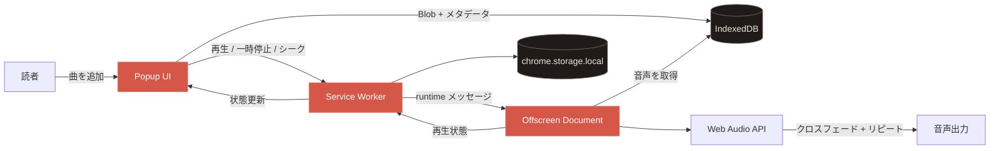

<p align="center">
  
</p>

<h1 align="center">Тихий кадр · 静かなコマ</h1>

<p align="center">
  <a href="../README.md">Русский</a> ·
  <a href="./README.en.md">English</a> ·
  <strong>日本語</strong> ·
  <a href="./README.zh-CN.md">简体中文</a>
</p>

<p align="center">
  漫画を静かに読むための、途切れないバックグラウンド音楽。<br />
  ローカル・ミニマル・プライベート。
</p>

<p align="center">
  <a href="https://github.com/BigVovaRUU/music/releases"></a>
  
  
  
</p>

<p align="center">
  <a href="https://github.com/BigVovaRUU/music/archive/refs/heads/main.zip"><strong>ソースをダウンロード</strong></a>
  ·
  <a href="https://github.com/BigVovaRUU/music/issues">不具合を報告</a>
  ·
  <a href="https://github.com/BigVovaRUU/music/issues/new">アイデアを提案</a>
</p>

<p align="center">
  
</p>

## このプロジェクトについて

**Тихий кадр（静かなコマ）** は、漫画・ライトノベル・集中作業のために作られたコンパクトな Chrome 音楽プレーヤーです。

音声ファイルを追加して再生を始めれば、ポップアップを閉じても音楽は続きます。次の曲は事前にデコードされ、現在の曲が終わる5秒前からクロスフェードします。曲が1つだけの場合は、同じ曲の新しい再生を重ねて無音区間を防ぎます。

> [!IMPORTANT]
> 音楽はサーバーへ送信されません。音声ファイルと再生状態は Chrome のローカル拡張機能プロファイル内だけに保存されます。

## 主な機能

| 機能 | 仕組み |
| --- | --- |
| 1曲の連続リピート | 同じ曲の次の再生を早めに開始して重ねます |
| 5秒クロスフェード | 現在の曲をフェードアウトしながら次の曲をフェードインします |
| バックグラウンド再生 | ポップアップを閉じても Offscreen Document が再生を継続します |
| ローカルライブラリ | 音声 Blob を拡張機能専用の IndexedDB に保存します |
| プレーヤー操作 | 再生・一時停止・シーク・音量・前後の曲 |
| プライバシー | 解析、アカウント、外部 API、ファイル送信はありません |

## インストール

1. [`main` ブランチの ZIP](https://github.com/BigVovaRUU/music/archive/refs/heads/main.zip)をダウンロードして展開します。
2. Chrome で `chrome://extensions` を開きます。
3. **デベロッパー モード**を有効にします。
4. **パッケージ化されていない拡張機能を読み込む**を選びます。
5. 展開したプロジェクトフォルダーを指定します。
6. ツールバーに「Тихий кадр」を固定します。

Git を使う場合：

```bash
git clone https://github.com/BigVovaRUU/music.git
cd music
```

更新後は `chrome://extensions` で拡張機能カードの再読み込みアイコンを押してください。

## 使い方

1. 拡張機能のポップアップを開きます。
2. **Добавить трек**（曲を追加）から1つ以上の音声ファイルを選びます。
3. ライブラリから曲を選んで Play を押します。
4. 音量や再生位置を調整します。
5. ポップアップを閉じても音楽はバックグラウンドで続きます。

## アーキテクチャ



## Chrome の権限

| 権限 | 目的 |
| --- | --- |
| `offscreen` | ポップアップを閉じた後も音声を再生するため |
| `storage` | 音量・再生位置・再生状態を保存するため |

閲覧履歴、タブ内容、カメラ、マイク、ネットワークへのアクセスは要求しません。

## 技術構成

- Chrome Extension Manifest V3
- Web Audio API
- Offscreen Documents API
- IndexedDB
- `chrome.storage.local`
- ビルド工程や実行時依存のない Vanilla JavaScript / HTML / CSS

## ローカル検証

```bash
node --check popup.js
node --check service-worker.js
node --check offscreen.js
```

主な確認フロー：

```text
音声を追加 → 再生 → ポップアップを閉じる → クロスフェード → 再度開く → 一時停止
```

## デザイン

木炭色の夜、和紙のような暖色テキスト、落ち着いた朱色、編集的な書体を組み合わせています。アイコンとイラストはこのプロジェクト専用に制作されました。

<details>
  <summary><strong>デザインコンセプトと実装を比較</strong></summary>
  <br />
  <p align="center">
    
    &nbsp;&nbsp;
    
  </p>
</details>

## ロードマップ

- [x] ローカル音声ライブラリ
- [x] バックグラウンド再生
- [x] 1曲の連続リピート
- [x] 5秒クロスフェード
- [x] 音量・シーク・キュー移動
- [ ] 漫画ジャンル別プレイリスト
- [ ] キーボードショートカット
- [ ] 設定のインポート / エクスポート
- [ ] Chrome Web Store での公開

## コントリビューション

不具合報告、アイデア、Pull Request を歓迎します。リポジトリを fork し、作業ブランチを作成して、ローカルで検証した変更を `main` 向けの Pull Request として送ってください。

不具合を報告する際は、Chrome のバージョン、再現手順、必要に応じて `chrome://extensions` のスクリーンショットを添えてください。

## FAQ

<details>
  <summary><strong>ポップアップを閉じても再生は続きますか？</strong></summary>
  <br />
  はい。Web Audio エンジンは Chrome の Offscreen Document で動作します。
</details>

<details>
  <summary><strong>音声ファイルはどこへアップロードされますか？</strong></summary>
  <br />
  どこにも送信されません。端末上の拡張機能専用 IndexedDB に保存されます。
</details>

<details>
  <summary><strong>対応する音声形式は？</strong></summary>
  <br />
  インストール済み Chrome がデコードできる形式に対応します。一般的な MP3、WAV、OGG、M4A/AAC などです。
</details>

---

<p align="center">
  物語を主役に、音楽をそっと隣に。
</p>
