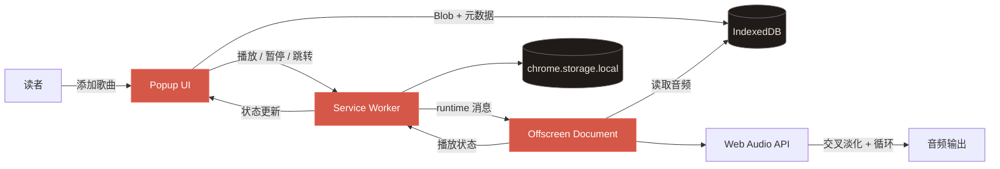

<p align="center">
  
</p>

<h1 align="center">Тихий кадр · 静谧画格</h1>

<p align="center">
  <a href="../README.md">Русский</a> ·
  <a href="./README.en.md">English</a> ·
  <a href="./README.ja.md">日本語</a> ·
  <strong>简体中文</strong>
</p>

<p align="center">
  为安静阅读漫画而设计的无缝背景音乐。<br />
  本地、极简，并以隐私为先。
</p>

<p align="center">
  <a href="https://github.com/BigVovaRUU/music/releases"></a>
  
  
  
</p>

<p align="center">
  <a href="https://github.com/BigVovaRUU/music/archive/refs/heads/main.zip"><strong>下载源代码</strong></a>
  ·
  <a href="https://github.com/BigVovaRUU/music/issues">报告问题</a>
  ·
  <a href="https://github.com/BigVovaRUU/music/issues/new">提出建议</a>
</p>

<p align="center">
  
</p>

## 项目简介

**Тихий кадр（静谧画格）** 是一款为阅读漫画、轻小说以及需要安静氛围的场景设计的 Chrome 音乐播放器。

添加音频文件并开始播放后，即使关闭弹窗，音乐也会继续在后台运行。下一首歌曲会被提前解码，并在当前歌曲结束前5秒开始交叉淡化。如果曲库中只有一首歌曲，播放器会提前启动同一歌曲的新实例，从而避免循环时出现空白。

> [!IMPORTANT]
> 音乐不会上传到任何服务器。音频文件和播放状态仅保存在本机 Chrome 扩展配置中。

## 功能

| 功能 | 工作方式 |
| --- | --- |
| 单曲连续循环 | 提前启动同一首歌曲的新实例并与结尾重叠 |
| 5秒交叉淡化 | 当前歌曲淡出时，下一首歌曲同步淡入 |
| 后台播放 | 关闭弹窗后由 Offscreen Document 继续播放 |
| 本地曲库 | 音频 Blob 保存在扩展专用 IndexedDB 中 |
| 播放控制 | 播放/暂停、进度、音量、上一首和下一首 |
| 多文件导入 | 可一次添加多个文件并按队列播放 |
| 隐私保护 | 无分析、无账号、无外部 API、无文件上传 |

## 安装

1. [下载 `main` 分支 ZIP](https://github.com/BigVovaRUU/music/archive/refs/heads/main.zip)并解压。
2. 在 Chrome 中打开 `chrome://extensions`。
3. 开启**开发者模式**。
4. 点击**加载已解压的扩展程序**。
5. 选择解压后的项目文件夹。
6. 将「Тихий кадр」固定到 Chrome 工具栏。

也可以使用 Git：

```bash
git clone https://github.com/BigVovaRUU/music.git
cd music
```

更新代码后，请在 `chrome://extensions` 页面点击扩展卡片上的重新加载按钮。

## 使用方法

1. 打开扩展弹窗。
2. 点击 **Добавить трек**（添加歌曲），选择一个或多个音频文件。
3. 在曲库中选择歌曲并点击 Play。
4. 根据需要调整音量和播放位置。
5. 关闭弹窗后，音乐仍会在后台播放。

## 架构



## Chrome 权限

扩展仅请求两个权限：

| 权限 | 用途 |
| --- | --- |
| `offscreen` | 弹窗关闭后继续播放音频 |
| `storage` | 保存音量、播放位置和播放状态 |

扩展不会申请浏览历史、标签页内容、摄像头、麦克风或网络访问权限。

## 技术栈

- Chrome Extension Manifest V3
- Web Audio API
- Offscreen Documents API
- IndexedDB
- `chrome.storage.local`
- 无构建步骤、无运行时依赖的原生 JavaScript / HTML / CSS

## 本地检查

```bash
node --check popup.js
node --check service-worker.js
node --check offscreen.js
```

建议测试完整流程：

```text
添加音频 → 播放 → 关闭弹窗 → 交叉淡化 → 重新打开 → 暂停
```

## 视觉设计

界面采用炭黑夜色背景、暖色宣纸质感文字、低饱和朱红强调色和编辑风格排版。图标与插画均为本项目专门制作。

<details>
  <summary><strong>比较设计概念与最终实现</strong></summary>
  <br />
  <p align="center">
    
    &nbsp;&nbsp;
    
  </p>
</details>

## 路线图

- [x] 本地音频曲库
- [x] 后台播放
- [x] 单曲无缝循环
- [x] 5秒交叉淡化
- [x] 音量、进度和队列控制
- [ ] 按漫画类型创建播放列表
- [ ] 键盘快捷键
- [ ] 设置导入与导出
- [ ] 发布到 Chrome 应用商店

## 参与贡献

欢迎提交问题、建议和 Pull Request。请 fork 仓库、创建功能分支、在本地完成测试，然后向 `main` 分支提交 Pull Request。

报告问题时，请提供 Chrome 版本、复现步骤，并在扩展出现错误时附上 `chrome://extensions` 页面的截图。

## 常见问题

<details>
  <summary><strong>关闭弹窗后音乐还会继续吗？</strong></summary>
  <br />
  会。Web Audio 引擎运行在 Chrome 的 Offscreen Document 中。
</details>

<details>
  <summary><strong>我的音乐会上传到哪里？</strong></summary>
  <br />
  不会上传。所有文件都保存在设备上的扩展专用 IndexedDB 中。
</details>

<details>
  <summary><strong>支持哪些音频格式？</strong></summary>
  <br />
  支持当前 Chrome 版本能够解码的格式，包括常见的 MP3、WAV、OGG 和 M4A/AAC。
</details>

---

<p align="center">
  让故事始终位于中心，让音乐静静陪伴。
</p>
